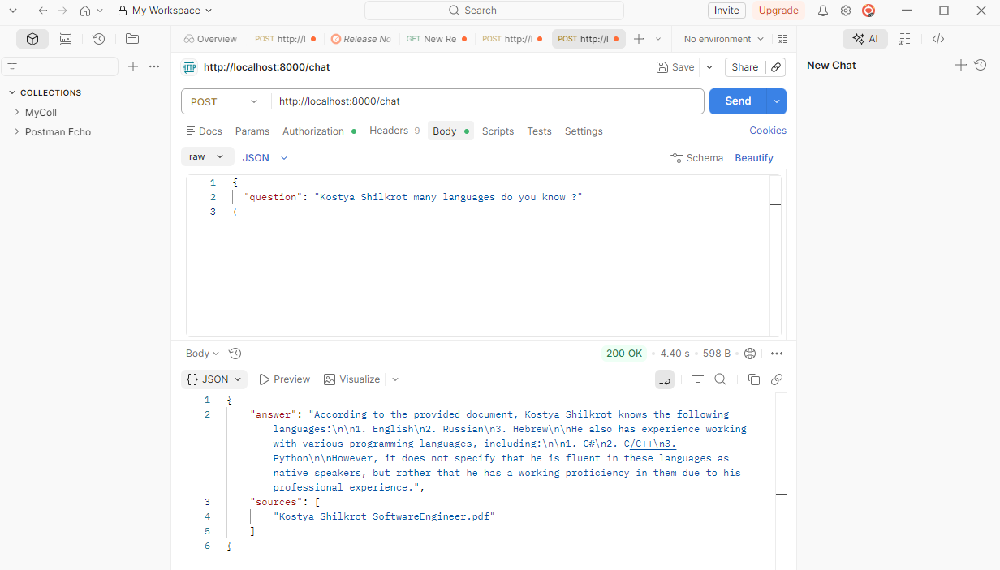
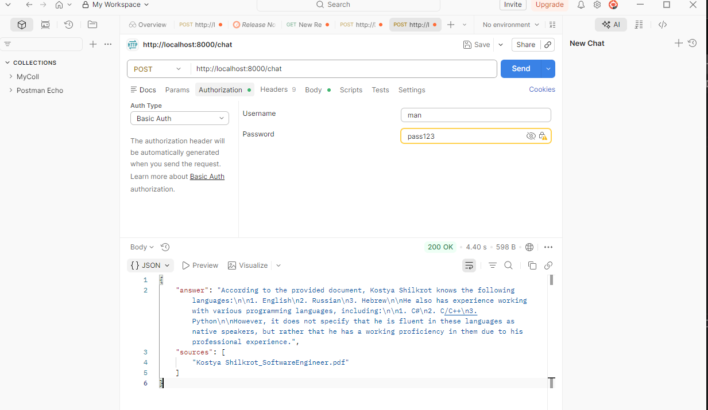

# Medical RAG AI Assistant

A role-based RAG (Retrieval-Augmented Generation) system for medical documents. Admins upload PDFs tagged to a role; users query the system and only receive answers from documents matching their role.

## Architecture

```
medical-rag-ai-assistant/
├── server/                     # FastAPI backend
│   ├── auth/                   # HTTP Basic Auth + bcrypt
│   │   ├── routes.py           # /signup, /login
│   │   ├── models.py           # Pydantic request models
│   │   └── hash_utils.py       # Password hashing
│   ├── chat/                   # RAG query pipeline
│   │   ├── routes.py           # /chat
│   │   ├── chat_query.py       # Embed → Pinecone → filter by role → LLM
│   │   └── models.py           # Pydantic request models
│   ├── docs/                   # Document ingestion
│   │   ├── routes.py           # /upload (admin only)
│   │   └── vectorstore.py      # PDF → chunks → embeddings → Pinecone
│   ├── config/
│   │   ├── db.py               # MongoDB connection
│   │   └── logger.py           # Centralized logging (console + rotating file)
│   ├── logs/                   # Runtime log output (auto-created)
│   ├── uploaded_docs/          # Temporary PDF storage (auto-created)
│   ├── main.py                 # FastAPI app + middleware
│   ├── pyproject.toml          # Dependencies (uv)
│   └── .env.example            # Environment variable template
└── frontend/                   # Streamlit UI
    ├── main.py                 # Login, signup, chat, admin upload
    ├── pyproject.toml          # Dependencies (uv)
    └── .env.example            # Frontend environment template
```

## Tech Stack

| Layer | Technology |
|---|---|
| API | FastAPI + Uvicorn |
| Auth | HTTP Basic Auth + bcrypt |
| Database | MongoDB Atlas |
| Embeddings | OpenAI `text-embedding-3-small` (768 dims) |
| Vector Store | Pinecone (serverless) |
| LLM | Groq `llama-3.1-8b-instant` |
| PDF Parsing | LangChain + PyPDF |
| Frontend | Streamlit |
| Package Manager | uv |

---

## Running the Backend

### 1. Install dependencies

```bash
cd server
uv sync
```

### 2. Configure environment

```bash
cp .env.example .env
# Fill in your values
```

Required variables:

| Variable | Description |
|---|---|
| `OPENAI_API_KEY` | For `text-embedding-3-small` embeddings |
| `GROQ_API_KEY` | For `llama-3.1-8b-instant` LLM |
| `MONGO_URI` | MongoDB Atlas connection string |
| `DB_NAME` | MongoDB database name |
| `PINECONE_API_KEY` | Pinecone API key |
| `PINECONE_ENVIRONMENT` | Pinecone region (e.g. `us-east-1`) |
| `PINECONE_INDEX_NAME` | Pinecone index name (e.g. `medical-rag`) |

### 3. Start the server

```bash
uv run main.py
```

Server starts at `http://localhost:8000`
Interactive API docs available at `http://localhost:8000/docs`

---

## Running the Frontend

### 1. Install dependencies

```bash
cd frontend
uv sync
```

### 2. Configure environment

```bash
cp .env.example .env
# Set API_URL to point at the backend
```

```env
API_URL=http://localhost:8000
```

### 3. Start the app

```bash
uv run streamlit run main.py
```

Frontend starts at `http://localhost:8501`

---

## API Endpoints

| Method | Path | Auth | Role | Description |
|---|---|---|---|---|
| GET | `/health` | None | Any | Health check |
| POST | `/signup` | None | Any | Register a user with a role |
| GET | `/login` | Basic Auth | Any | Verify credentials |
| POST | `/upload` | Basic Auth | `admin` | Upload PDF → embed → store in Pinecone |
| POST | `/chat` | Basic Auth | Any | Ask a question, get role-filtered RAG answer |

---

## Roles & Permissions

The system has three roles. Each role controls both **what actions a user can perform** and **which documents they can query**.

| Role | Sign Up | Ask Questions | Upload Documents | Sees Documents Tagged |
|---|---|---|---|---|
| `user` | ✅ Self-service | ✅ | ❌ | `user` |
| `doctor` | ✅ Self-service | ✅ | ❌ | `doctor` |
| `admin` | ✅ Self-service | ✅ | ✅ | `admin` |

### Key rules

- **Upload** (`POST /upload`) is restricted to `admin` accounts only. When uploading, the admin assigns each document a **target role** (`user`, `doctor`, or `admin`). This controls which role of users can retrieve it.
- **Chat** (`POST /chat`) is available to all roles. The RAG pipeline filters retrieved document chunks by the requesting user's role — a `doctor` user only receives context from documents tagged `doctor`.
- An `admin` who uploads a document assigned to `doctor` **cannot retrieve it themselves** — they would need to assign it to `admin` to access it via chat.

### Example workflow

```
Admin uploads drug-reference.pdf → assigns to role: doctor
  └── Doctor logs in → asks "What is the dosage for amoxicillin?"
        └── RAG retrieves only doctor-tagged chunks → LLM answers with source citation

Admin uploads admin-protocols.pdf → assigns to role: admin
  └── Admin logs in → asks "What are the escalation protocols?"
        └── RAG retrieves only admin-tagged chunks → LLM answers
```

---

## How It Works

1. **Signup** — create a user with role `admin`, `doctor`, or `user`
2. **Upload** — admin uploads a PDF and assigns it a target role; the document is chunked, embedded, and stored in Pinecone with `role` metadata
3. **Chat** — a logged-in user asks a question; the backend embeds the query, retrieves the top matching vectors from Pinecone, filters by the user's role, and sends the context to the LLM for a grounded answer

---

## Screenshots



